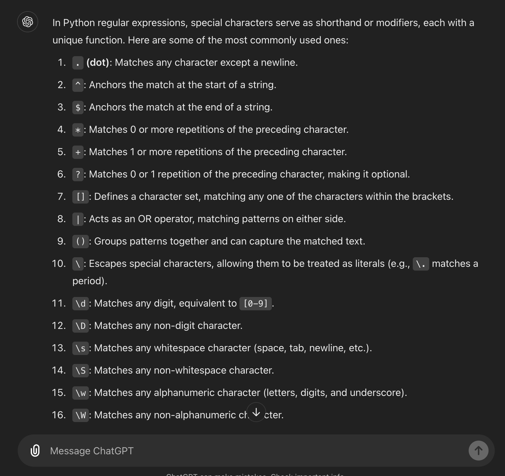
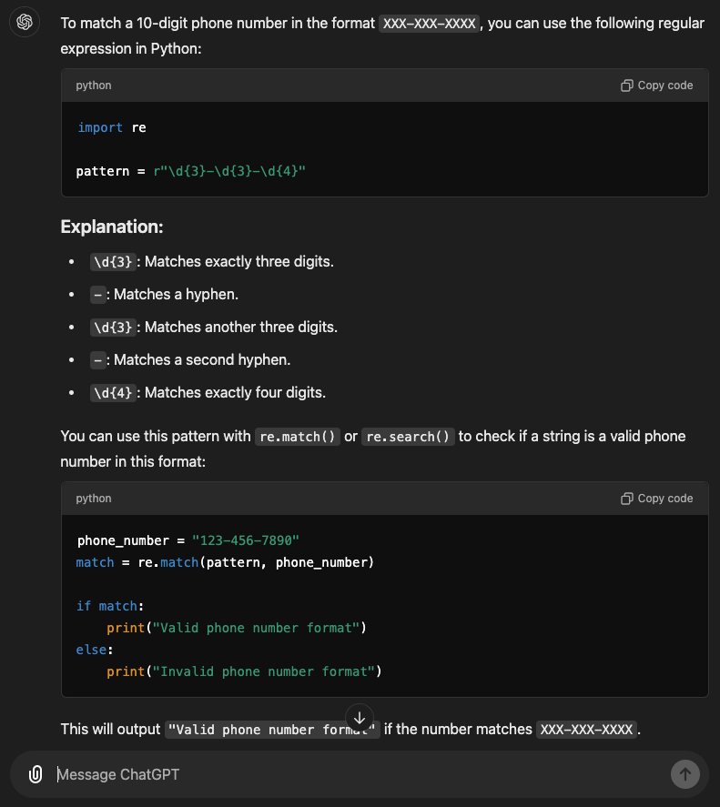
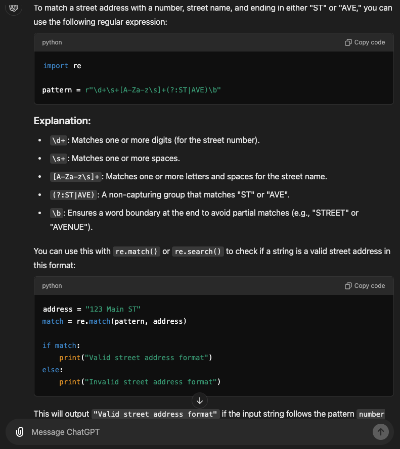
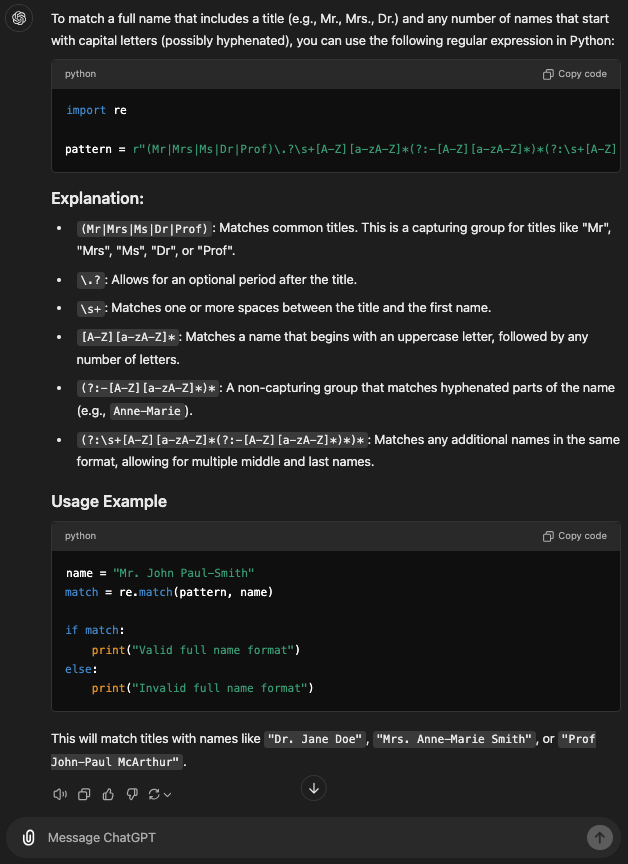
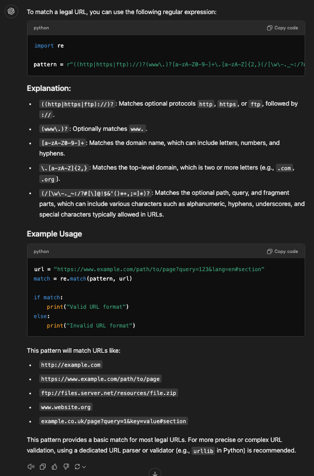
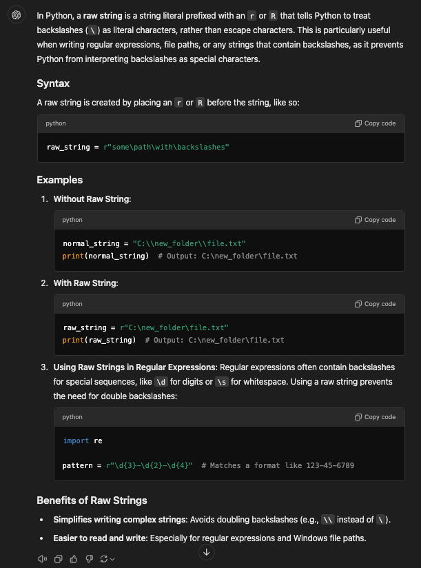

# Exercise 1

* Prompt: What are the most common special characters used in Python regular expressions?


* Prompt: Write a Python regular expression that matches a 10-digit phone number with hyphens.


* Write a Python regular expression that matches a street address with a number and a street name, followed by ST or AVE.


* Write a Python regular expression that matches a full name with any common title like Mr or Mrs followed by any number of names beginning with capital letters, possibly with hyphens between some names.
```python
import re

pattern = r"(Mr|Mrs|Ms|Dr|Prof)\.?\s+[A-Z][a-zA-Z]*(?:-[A-Z][a-zA-Z]*)*(?:\s+[A-Z][a-zA-Z]*(?:-[A-Z][a-zA-Z]*)*)*"
```


* Write a regular expression that matches any legal URL.
```python
import re

pattern = r"((http|https|ftp)://)?(www\.)?[a-zA-Z0-9-]+\.[a-zA-Z]{2,}(/[\w\-._~:/?#[\]@!$&'()*+,;=]*)?"
```


* What is a raw string in Python?
